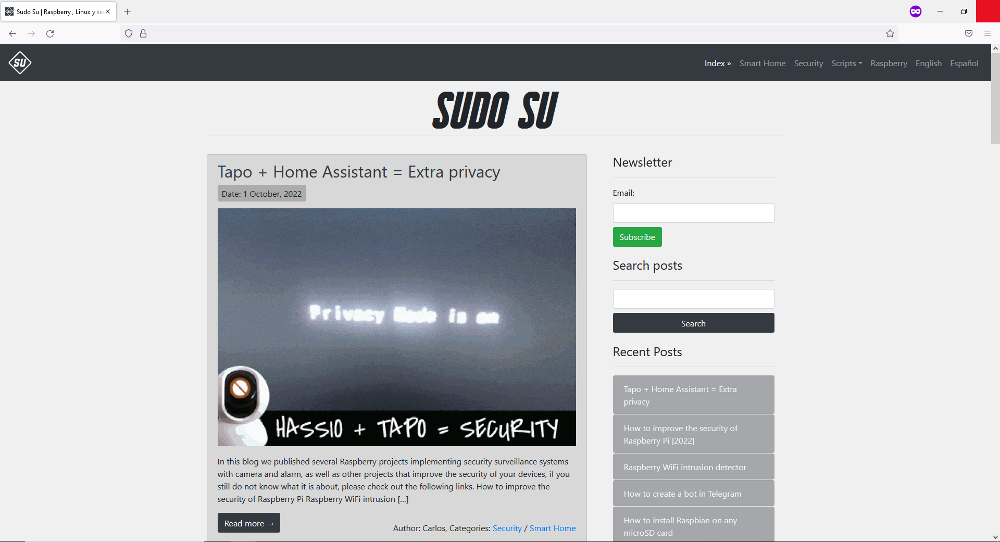
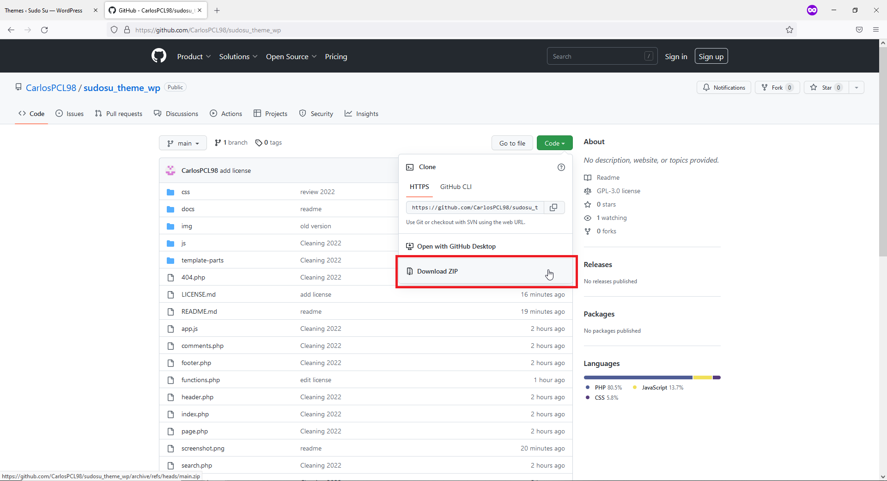
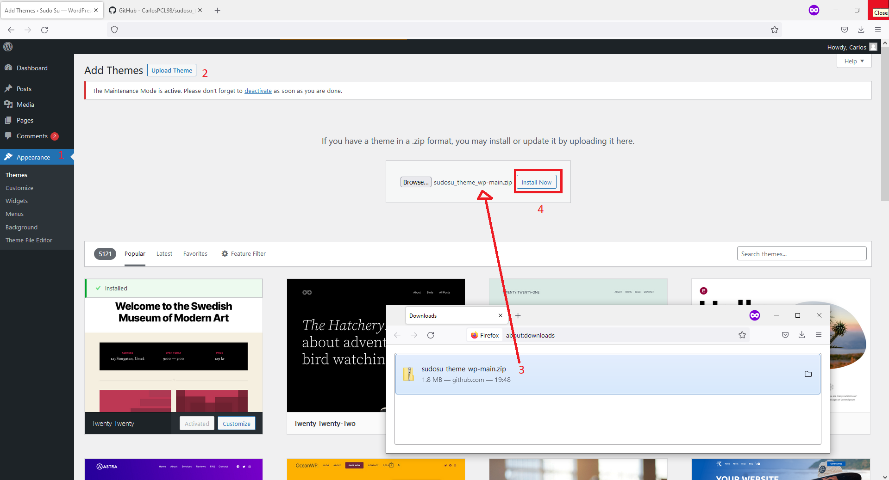
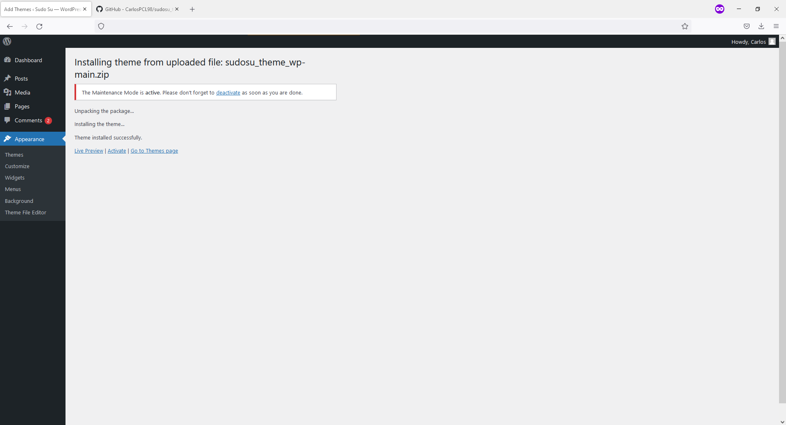
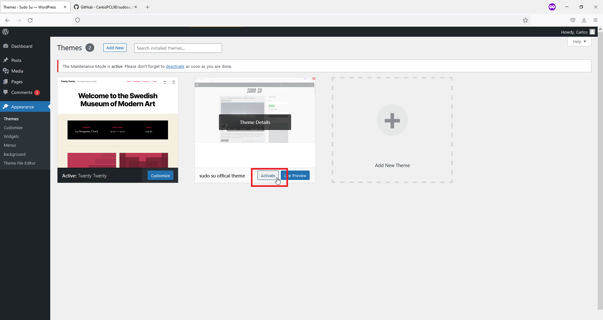

<!-- # Sudo su - WP theme -->
<!-- Preview: [https://www.sudosu.info/](https://www.sudosu.info/) -->
<h1 align="center"><a href="https://www.sudosu.info" target="_blank">Sudo Su - Official Wordpress Theme</a></h1>

## History
During the first quarantine of the SARS-CoV-2 pandemic of 2020, I had the idea to invest my time at home, in creating a personal blog to publish my personal projects. The theme was coded from zero, after several courses of creation of Themes and Plugins for Wordpress.

I have been using this theme for several years and it has worked well, now I want to share it here, so anyone can edit it or use it as a reference to create their own theme. :smiley:

## Features

 Compatible with PolyLang

 Ready for multi language  (EN-GB) and  (ES)

 Builded with Bootstrap

